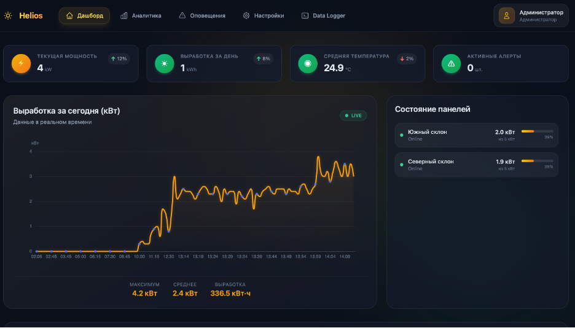
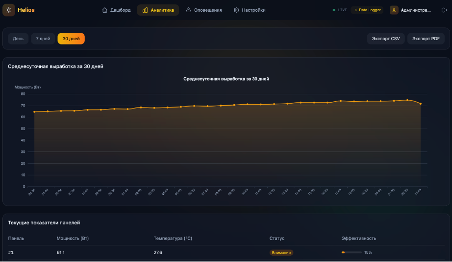
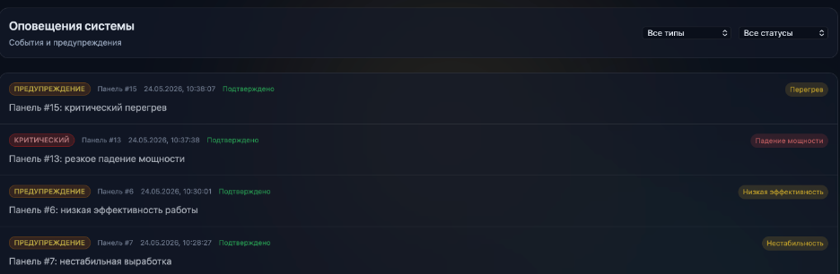
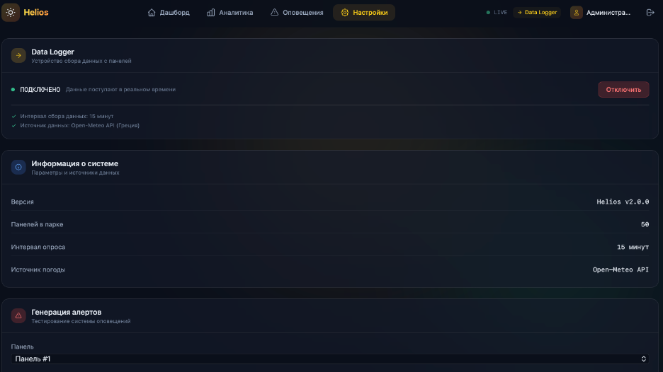
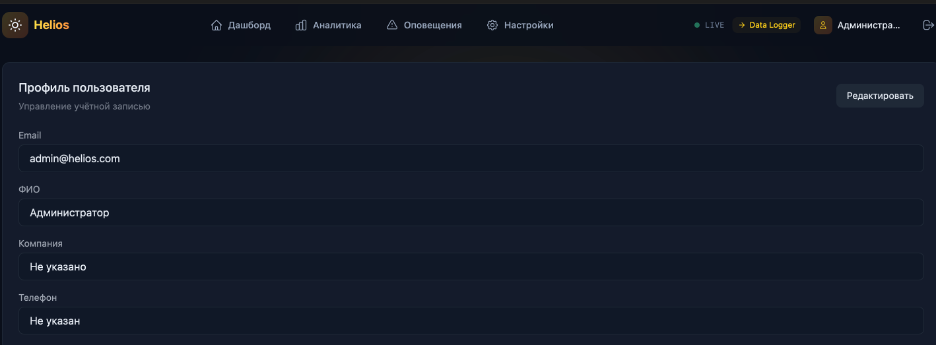

# ☀️ Helios — Solar Monitoring System

<div align="center">


**Система мониторинга солнечных панелей в реальном времени**

[Демонстрация](#-скриншоты) • [Установка](#-установка) • [API](#-api) • [Тестирование](#-тестирование)

</div>

---

## О проекте

**Helios** — это веб-приложение для мониторинга парка из 50 солнечных панелей. Система отображает ключевые показатели в реальном времени, строит графики выработки, отправляет оповещения о нештатных ситуациях и позволяет экспортировать отчёты.

### Основные функции

| Функция | Описание |
|---------|----------|
| **Дашборд** | KPI карточки, график выработки за 24 часа, сетка из 50 панелей с цветовой индикацией |
| **Аналитика** | Графики за день / 7 дней / 30 дней, экспорт в CSV и PDF |
| **Оповещения** | История алертов, фильтрация, подтверждение, браузерные push-уведомления |
| **Настройки** | Подключение Data Logger, генерация тестовых алертов (для администратора) |
| **Профиль** | Редактирование личной информации |

### Архитектура

```
┌─────────────────┐     ┌─────────────────┐     ┌─────────────────┐
│   Frontend      │────▶│    Backend      │────▶│    Database     │
│   React         │◀────│    FastAPI      │◀────│    SQLite       │
│   TypeScript    │ WS  │    Python       │     │                 │
└─────────────────┘     └─────────────────┘     └─────────────────┘
                              │
                              ▼
                        ┌─────────────────┐
                        │  Open-Meteo API │
                        │  (Греция, погода)│
                        └─────────────────┘
```

### Технологии

**Backend**
- FastAPI — веб-фреймворк
- SQLite + SQLAlchemy — база данных
- JWT — аутентификация
- WebSocket — real-time обновления
- Open-Meteo API — погодные данные

**Frontend**
- React 18 + TypeScript
- Tailwind CSS — стилизация
- ECharts — графики
- React Router — навигация

---

## Скриншоты

### Главный экран (дашборд)



*Ключевые показатели, график выработки, сетка из 50 панелей*

### Экран аналитики



*Выбор периода, экспорт отчётов*

### Экран оповещений



*История алертов, фильтрация, подтверждение*

### Экран настроек



*Подключение Data Logger, генерация тестовых алертов*

### Экран профиля



*Редактирование личной информации*

---

## Установка

### Требования

- Python 3.11+
- Node.js 18+
- pip, npm

### 1. Клонирование репозитория

```bash
git clone https://github.com/your-username/helios-monitoring.git
cd helios-monitoring
```

### 2. Запуск серверной части

```bash
cd backend
python3 -m venv venv
source venv/bin/activate  # Windows: venv\Scripts\activate
pip install -r requirements.txt
python3 -m uvicorn main:app --reload --port 8000
```

### 3. Запуск клиентской части

```bash
cd frontend
npm install
npm run dev
```

### 4. Открыть в браузере

```
http://localhost:5173
```

### Тестовые учётные записи

| Роль | Email | Пароль |
|------|-------|--------|
| Администратор | admin@helios.com | admin123 |
| Пользователь | user@helios.com | user123 |

---

## API

| Метод | Эндпоинт | Описание |
|-------|----------|----------|
| POST | `/api/auth/register` | Регистрация |
| POST | `/api/auth/login` | Вход |
| GET | `/api/data` | Данные 50 панелей |
| GET | `/api/history/park?hours=24` | История за 24 часа |
| GET | `/api/history/park/daily?days=7` | Среднесуточная за 7 дней |
| POST | `/api/connect` | Подключить Data Logger |
| POST | `/api/disconnect` | Отключить Data Logger |
| GET | `/api/alerts/history` | История оповещений |
| WS | `/ws/live` | WebSocket для real-time |

**Полная документация**: `http://localhost:8000/docs`

---

## Тестирование

### Запуск тестов

```bash
cd backend
source venv/bin/activate
python tests/test_auth.py
python tests/test_data.py
python tests/test_unit.py
```

### Результаты тестирования

```
=== Запуск тестов аутентификации ===
✅ Сервер запущен
✅ Регистрация успешна
✅ Вход выполнен, токен получен

=== Запуск тестов данных ===
✅ Data Logger подключён
✅ Получены данные: 50 панелей
✅ Получена история: 84 точек данных

=== Модульное тестирование ===
✅ Тест хеширования пароля пройден
✅ Тест расчёта статуса панели пройден
✅ Тест расчёта статуса по температуре пройден
```

### Тест-кейсы

| № | Тест | Статус |
|---|------|--------|
| 1 | Регистрация пользователя | ✅ |
| 2 | Вход в систему | ✅ |
| 3 | Подключение Data Logger | ✅ |
| 4 | Отображение 50 панелей | ✅ |
| 5 | Детали панели (модальное окно) | ✅ |
| 6 | Переключение периода на графике | ✅ |
| 7 | Экспорт CSV | ✅ |
| 8 | Экспорт PDF | ✅ |
| 9 | Браузерное уведомление | ✅ |
| 10 | Отключение Data Logger | ✅ |

---

## 📁 Структура проекта

```
helios-monitoring/
├── backend/
│   ├── app/
│   │   ├── database.py      # Модели БД
│   │   ├── user_service.py  # Пользователи
│   │   ├── simulator.py     # Симулятор данных
│   │   └── measurement_service.py
│   ├── tests/               # Тесты
│   ├── main.py              # Точка входа
│   └── requirements.txt
├── frontend/
│   ├── src/
│   │   ├── pages/           # Страницы
│   │   ├── components/      # Компоненты
│   │   ├── services/        # API клиенты
│   │   └── hooks/           # Кастомные хуки
│   ├── public/
│   └── package.json
└── screenshots/             # Скриншоты для README
```

---

## Разработчик

**Завершинская Полина Сергеевна**
- Группа: ЭФБО-01-24
- РТУ МИРЭА, Институт перспективных технологий и индустриального программирования

---

